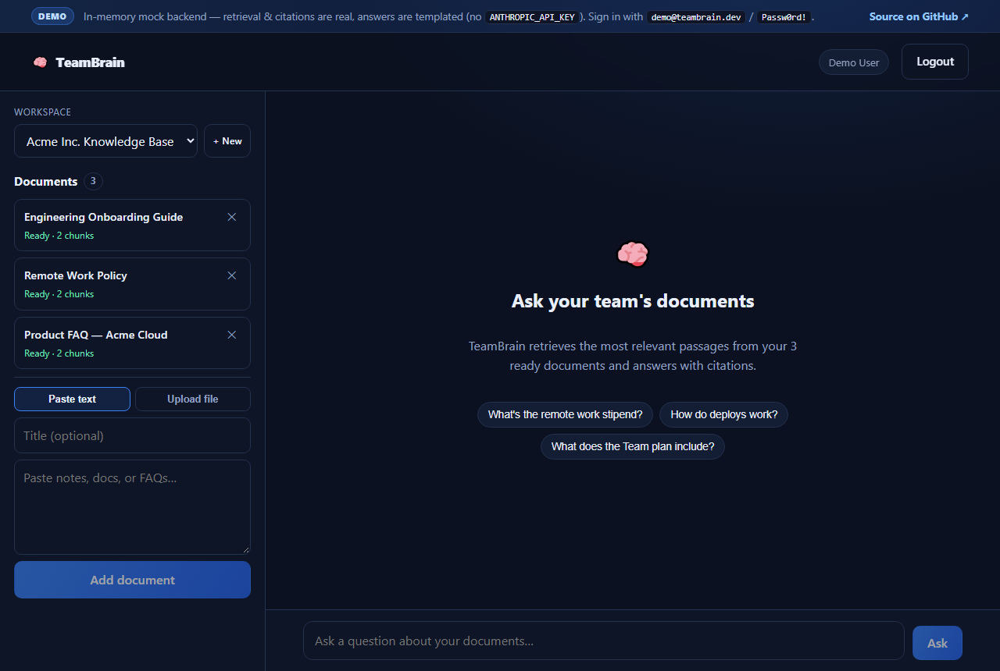
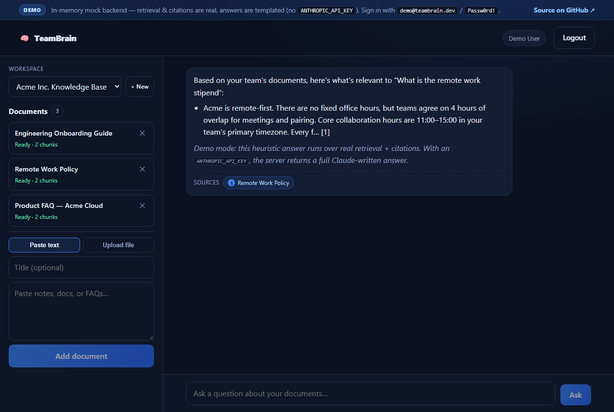

# TeamBrain

[](https://sarfrazahmeds.github.io/teambrain/)


A **multi-tenant RAG (retrieval-augmented generation) knowledge base** — a typed
**Express + Prisma + pgvector** API **and a React chat client**. Teams upload their documents
into isolated workspaces; TeamBrain chunks and embeds them into **PostgreSQL + pgvector**, then
answers questions with **Claude** — grounded in each team's own documents, with citations back
to the source chunks.

> **Runs free out of the box.** Embeddings are generated locally (no key, no cost). Leave
> `ANTHROPIC_API_KEY` empty to run in **demo mode** — retrieval and citations are fully real,
> and answers come from a built-in mock generator. Add a key to get full Claude-written answers.

## 🕹️ Live Demo

**▶️ Try it live — [sarfrazahmeds.github.io/teambrain](https://sarfrazahmeds.github.io/teambrain/)**

The demo runs the **real React client** against an **in-memory mock backend** — no server or
database to set up. Retrieval and citations are real (scored over the seeded documents); the
answer prose is templated (a real `ANTHROPIC_API_KEY` on the server gives full Claude-written
answers). Sign in with `demo@teambrain.dev` / `Passw0rd!`, then ask about the seeded
"Acme Inc." workspace — or add your own documents.

| Workspace + documents | Ask — grounded in your docs, with citations |
| :---: | :---: |
|  |  |

---

## Features

- **Multi-tenant workspaces** — every document, chunk and conversation is scoped to a
  workspace; users join workspaces via memberships with per-workspace roles
  (`OWNER` / `ADMIN` / `MEMBER`).
- **Document ingestion** — upload PDFs; the service extracts text, splits it into overlapping
  chunks, embeds each chunk and stores the vectors in Postgres via **pgvector**.
- **Retrieval-augmented answers** — questions are embedded, the nearest chunks are retrieved
  by vector similarity, and Claude answers using only that retrieved context — with citations.
- **Local embeddings** — `Xenova/all-MiniLM-L6-v2` (384-dim) runs in-process, so ingestion and
  search need no external API and no cost.
- **Secure auth** — email/password with hashed credentials, short-lived JWT access tokens and
  rotating refresh tokens; login throttled by a dedicated rate-limiter.
- **Hardened API** — Helmet, CORS, per-route Zod validation, centralised error handling and
  rate-limiting.
- **CI** — GitHub Actions spins up a pgvector Postgres, runs Prisma, type-checks and builds
  the server on every push and PR.

## Tech stack

| Layer        | Tech |
|--------------|------|
| Runtime      | Node.js 20, TypeScript |
| API          | Express, Zod, Helmet, express-rate-limit |
| Data         | PostgreSQL + **pgvector**, Prisma ORM |
| Embeddings   | `@xenova/transformers` (all-MiniLM-L6-v2, 384-dim, local) |
| LLM          | Anthropic **Claude** (optional — demo mode without a key) |
| Auth         | JWT (access + rotating refresh), bcrypt |
| Ingestion    | `pdf-parse`, custom chunker |
| Client       | React 19, Vite, React Router, react-markdown |
| Dev / CI     | Docker Compose (pgvector), GitHub Actions |

## Architecture

```
Upload PDF ─▶ extract text ─▶ chunk (size 1200 / overlap 200) ─▶ embed (MiniLM, 384-d)
                                                                      │
                                                              store in pgvector
                                                                      │
Ask question ─▶ embed query ─▶ vector search (top-K) ─▶ Claude (grounded) ─▶ answer + citations
```

Data model (Prisma): `User`, `Workspace`, `Membership`, `Document`, `Chunk`,
`Conversation`, `Message`, `RefreshToken`.

## Getting started

```bash
# 1. Start a pgvector-enabled Postgres
docker compose up -d

# 2. Configure the server
cd server
cp .env.example .env          # generate JWT secrets: openssl rand -hex 32
                              # (ANTHROPIC_API_KEY optional — empty = demo mode)

# 3. Install, migrate, seed
npm install
npx prisma migrate dev
npm run db:seed

# 4. Run the API (http://localhost:4000)
npm run dev

# 5. Run the client (http://localhost:5173) — in another terminal
cd ../client
npm install
npm run dev        # Vite proxies /api → :4000
```

## API overview

All routes are under `/api`; authenticated requests send `Authorization: Bearer <accessToken>`.

**Auth** — `/api/auth`
| Method | Route | Description |
|--------|-------|-------------|
| POST | `/register` | Create an account → access + refresh tokens |
| POST | `/login` | Log in (rate-limited) |
| POST | `/refresh` | Rotate the refresh token |
| POST | `/logout` | Revoke the refresh token |

**Workspaces** — `/api/workspaces`
| Method | Route | Description |
|--------|-------|-------------|
| GET | `/` | List the caller's workspaces |
| POST | `/` | Create a workspace (caller becomes `OWNER`) |
| GET | `/:workspaceId` | Workspace detail + members |

**Documents** — `/api/workspaces/:workspaceId/documents`
| Method | Route | Description |
|--------|-------|-------------|
| GET | `/` | List documents |
| POST | `/` | Upload a file or text → chunk + embed |
| GET | `/:documentId` | Get one document |
| DELETE | `/:documentId` | Delete (`OWNER` / `ADMIN` only) |

**Chat (RAG)** — `/api/workspaces/:workspaceId`
| Method | Route | Description |
|--------|-------|-------------|
| POST | `/ask` | Ask a question → retrieves the top-K chunks, answers with Claude (or the offline mock), returns `{ answer, citations, conversationId }` |
| GET | `/conversations` | List the caller's conversations |
| GET | `/conversations/:conversationId` | A conversation with its messages |

> Every workspace-scoped route is guarded by membership — one workspace can never read another's documents or chats.

## Configuration

Key `.env` settings (see [`server/.env.example`](server/.env.example)):

| Variable | Purpose |
|----------|---------|
| `DATABASE_URL` | pgvector-enabled Postgres connection string |
| `JWT_ACCESS_SECRET` / `JWT_REFRESH_SECRET` | token signing secrets |
| `ANTHROPIC_API_KEY` | optional — empty runs demo mode |
| `EMBEDDING_MODEL` / `EMBEDDING_DIM` | local embedding model (384-dim) |
| `CHUNK_SIZE` / `CHUNK_OVERLAP` / `RETRIEVAL_K` | RAG tuning |
| `MAX_UPLOAD_MB` | upload size limit |

## Project structure

```
server/
  src/
    modules/        auth · workspaces · documents · chat (RAG)
    lib/            embeddings · chunk · llm (Claude) · retrieve · jwt · prisma
    middleware/     authenticate · workspace · validate · rateLimit · errorHandler
  prisma/           schema + seed
client/             React + Vite chat UI (auth · workspace · documents · RAG chat)
  src/api/demo.ts   in-memory mock backend for the static live demo
.github/workflows/  ci.yml · deploy-demo.yml (GitHub Pages)
docker-compose.yml  pgvector Postgres for local dev
```

## License

[MIT](LICENSE)
